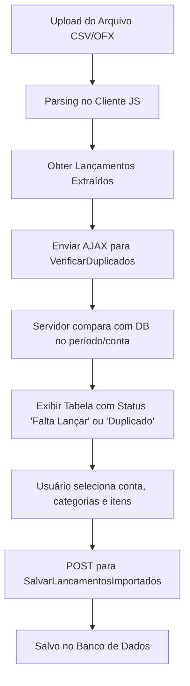

# Especificação Técnica: Módulo de Importação de Extratos e Conciliação Bancária

> **Nota:** Este documento foi elaborado para servir como um guia completo e instrução técnica para modelos de Inteligência Artificial ou desenvolvedores implementarem ou refatorarem os recursos de **Importação de Extratos (CSV / OFX)** e **Conciliação Bancária** (anteriormente denominado "Comparar Extrato").

---

## 1. Visão Geral do Módulo

O módulo de **Lançamentos Financeiros** possui duas funcionalidades centrais relacionadas à integração com extratos bancários:

1. **Importação de Extrato (`ImportarExtrato`)**: Permite a ingestão de arquivos bancários nos formatos **CSV** e **OFX**, parsing no cliente, verificação de duplicados em relação ao banco de dados e gravação em lote dos novos lançamentos.
2. **Conciliação Bancária (`CompararExtrato`)**: Compara os registros presentes no arquivo de extrato bancário com os lançamentos existentes no banco de dados para a conta e período selecionados, identificando:
   - Registros **Conciliados** (presentes em ambos com mesma Data, Valor e Tipo).
   - Registros **Apenas no Extrato** (faltantes no sistema, com opção de salvar em lote).
   - Registros **Apenas no Sistema** (cadastrados no sistema no período, mas ausentes no extrato).

---

## 2. Modelos de Dados e Enumerações

### 2.1 Enum `TipoLancamento`
```csharp
namespace GestorContas.Web.Models.Enums
{
    public enum TipoLancamento
    {
        Entrada = 1,
        Saida = 2
    }
}
```

### 2.2 Entidade `Lancamento`
```csharp
namespace GestorContas.Web.Models
{
    public class Lancamento
    {
        [Key]
        public int Id { get; set; }

        [Required(ErrorMessage = "O campo {0} é obrigatório")]
        [StringLength(200, ErrorMessage = "O campo {0} deve ter no máximo {1} caracteres")]
        [Display(Name = "Descrição")]
        public string Descricao { get; set; }

        [Required(ErrorMessage = "O campo {0} é obrigatório")]
        [DataType(DataType.Currency)]
        [Column(TypeName = "decimal(18,2)")]
        [Display(Name = "Valor")]
        public decimal Valor { get; set; }

        [Required(ErrorMessage = "O campo {0} é obrigatório")]
        [Display(Name = "Tipo")]
        public TipoLancamento Tipo { get; set; }

        [Required(ErrorMessage = "O campo {0} é obrigatório")]
        [DataType(DataType.Date)]
        [DisplayFormat(DataFormatString = "{0:dd/MM/yyyy}", ApplyFormatInEditMode = true)]
        [Display(Name = "Data")]
        public DateTime Data { get; set; } = DateTime.Now.Date;

        [Required(ErrorMessage = "O campo {0} é obrigatório")]
        [Display(Name = "Categoria")]
        public int CategoriaId { get; set; }

        public Categoria? Categoria { get; set; }

        [Required(ErrorMessage = "O campo {0} é obrigatório")]
        [Display(Name = "Conta")]
        public int ContaId { get; set; }

        public Conta? Conta { get; set; }
    }
}
```

### 2.3 DTOs para Requisições AJAX
```csharp
public class VerificarDuplicadosRequest
{
    public int ContaId { get; set; }
    public List<LancamentoImportacaoDto> Lancamentos { get; set; } = new();
}

public class LancamentoImportacaoDto
{
    public DateTime Data { get; set; }
    public decimal Valor { get; set; }
    public int Tipo { get; set; }
}

public class CompararExtratoRequest
{
    public int ContaId { get; set; }
    public List<LancamentoComparacaoItemDto> Lancamentos { get; set; } = new();
}

public class LancamentoComparacaoItemDto
{
    public DateTime Data { get; set; }
    public decimal Valor { get; set; }
    public int Tipo { get; set; }
    public string Descricao { get; set; }
}
```

---

## 3. Especificação de Ingestão e Parsing de Arquivos

### 3.1 Tratamento de Encodings
- **Encoding Padrão**: Iniciar a leitura via `FileReader` utilizando o charset `ISO-8859-1` (comum em extratos bancários brasileiros).
- **Detecção UTF-16**: Caso o conteúdo lido contenha caracteres nulos (`\0`), reexecutar o leitor configurando o encoding para `UTF-16`.

---

### 3.2 Parsing de Arquivo OFX (Open Financial Exchange)

1. **Quebra em Blocos**:
   - Dividir o conteúdo utilizando a expressão regular `/<STMTTRN\s*>/i`.
   - Iterar sobre os blocos até o fechamento `</STMTTRN>`.
2. **Extração de Tags**:
   - `TRNTYPE`: Tipo da transação no OFX (ex: `DEBIT`, `CREDIT`, `OTHER`).
   - `DTPOSTED`: Data do lançamento no formato `YYYYMMDD...` (obter os 8 primeiros caracteres para extrair `YYYY`, `MM` e `DD`).
   - `TRNAMT`: Valor numérico (positivo ou negativo). Substituir vírgulas por ponto e parsear para float/decimal.
   - `MEMO` / `NAME`: Descrição/histórico da transação. Fallback para "Sem descrição" se vazio.
3. **Definição de Tipo e Valor**:
   - **Tipo 2 (Saída)**: Se `Valor < 0` ou `TRNTYPE == 'DEBIT'`.
   - **Tipo 1 (Entrada)**: Demais casos.
   - **Valor**: Armazenar sempre como valor absoluto positivo (`Math.abs(valor)`).

---

### 3.3 Parsing de Arquivo CSV

1. **Detecção e Seleção de Delimitador**:
   - **Auto-detecção**: Varrer as primeiras 10 linhas contando a ocorrência de `;` (ponto e vírgula) vs `,` (vírgula). Se o total de vírgulas for maior, assumir separador `,`, caso contrário `;`.
   - **Seleção Manual**: Permitir override pelo usuário por meio de radio buttons (`csvSeparator` / `compCsvSeparator`).
2. **Estrutura por Delimitador**:
   - **Separador Ponto e Vírgula (`;`)**:
     - Coluna 0: Data (formato `DD/MM/YYYY`).
     - Coluna 3: Histórico / Descrição.
     - Coluna 4: Valor (positivo para entradas, negativo para saídas).
   - **Separador Vírgula (`,`)**:
     - Coluna 0: Data (formato `DD/MM/YYYY`).
     - Coluna 2: Descrição.
     - Coluna 4: Crédito (Entrada).
     - Coluna 5: Débito (Saída).
3. **Regras de Negócio e Limpeza**:
   - Ignorar linhas vazias e o cabeçalho.
   - Ignorar transações cujo histórico contenha `"SALDO ANTERIOR"`.
   - Validar expressão regular de data: `/^\d{2}\/\d{2}\/\d{4}$/`.
   - Remover aspas e espaços do valor antes da conversão decimal.

---

## 4. Funcionalidade 1: Importar Extrato (`/Lancamentos/ImportarExtrato`)

### 4.1 Fluxo de Trabalho (Workflow)


### 4.2 Verificação de Duplicados (`VerificarDuplicados`)
- **Regra de Consulta**:
  O servidor recebe `ContaId` e a lista de DTOs. Calcula `minDate` e `maxDate` dos lançamentos recebidos e busca no banco de dados:
  ```csharp
  var existentes = await _context.Lancamentos
      .Where(l => l.ContaId == request.ContaId && l.Data >= minDate && l.Data <= maxDate)
      .Select(l => new { l.Id, l.Data, l.Valor, l.Tipo, l.Descricao })
      .ToListAsync();
  ```
- **Algoritmo de Correspondência (1 para 1)**:
  Utiliza um `HashSet<int> matchedIds` para garantir que cada lançamento do banco corresponda a no máximo um lançamento importado.
  - **Match**: `e.Data.Date == item.Data.Date && e.Valor == item.Valor && (int)e.Tipo == item.Tipo`.
  - Retorna o status `"duplicado"` (marcando a linha com fundo destacado `table-warning-bg` e checkbox desmarcado por padrão) ou `"novo"` (checkbox marcado por padrão).

### 4.3 Salvamento em Lote (`SalvarLancamentosImportados`)
- O cliente filtra as linhas com checkbox marcado e envia via `JSON` para o endpoint `/Lancamentos/SalvarLancamentosImportados`.
- O servidor define `Id = 0` para cada objeto e executa `_context.Lancamentos.Add(lancamento)` seguido de `SaveChangesAsync()`.

---

## 5. Funcionalidade 2: Conciliação Bancária (`/Lancamentos/CompararExtrato`)

### 5.1 Conceito e Diferencial
Diferente da importação direta, a **Conciliação Bancária** foca no cruzamento completo das duas fontes de dados no período do extrato:
1. **Extrato Bancário** (arquivo importado).
2. **Sistema Financial** (lançamentos existentes no banco de dados para a conta e período).

### 5.2 Algoritmo de Processamento da Conciliação (`ProcessarComparacaoExtrato`)
```csharp
[HttpPost]
[ValidateAntiForgeryToken]
public async Task<IActionResult> ProcessarComparacaoExtrato([FromBody] CompararExtratoRequest request)
{
    if (request == null || request.Lancamentos == null || !request.Lancamentos.Any())
        return Json(new { success = true, conciliados = new List<object>(), apenasExtrato = new List<object>(), apenasSistema = new List<object>(), totalExtrato = 0, totalSistemaNoPeriodo = 0 });

    var datas = request.Lancamentos.Select(l => l.Data.Date).Distinct().ToList();
    var minDate = datas.Min();
    var maxDate = datas.Max();

    var lancamentosDb = await _context.Lancamentos
        .Include(l => l.Categoria)
        .Include(l => l.Conta)
        .Where(l => l.ContaId == request.ContaId && l.Data.Date >= minDate && l.Data.Date <= maxDate)
        .OrderBy(l => l.Data)
        .ToListAsync();

    var matchedDbIds = new HashSet<int>();
    var conciliados = new List<object>();
    var apenasExtrato = new List<object>();

    foreach (var item in request.Lancamentos)
    {
        var match = lancamentosDb.FirstOrDefault(e => 
            !matchedDbIds.Contains(e.Id) &&
            e.Data.Date == item.Data.Date && 
            e.Valor == item.Valor && 
            (int)e.Tipo == item.Tipo);

        if (match != null)
        {
            matchedDbIds.Add(match.Id);
            conciliados.Add(new {
                extrato = new { data = item.Data.ToString("yyyy-MM-dd"), descricao = item.Descricao, valor = item.Valor, tipo = item.Tipo },
                sistema = new { id = match.Id, data = match.Data.ToString("yyyy-MM-dd"), descricao = match.Descricao, valor = match.Valor, tipo = (int)match.Tipo, categoriaNome = match.Categoria?.Nome ?? "Sem Categoria" }
            });
        }
        else
        {
            apenasExtrato.Add(new { data = item.Data.ToString("yyyy-MM-dd"), descricao = item.Descricao, valor = item.Valor, tipo = item.Tipo });
        }
    }

    var apenasSistema = lancamentosDb
        .Where(e => !matchedDbIds.Contains(e.Id))
        .Select(e => new { id = e.Id, data = e.Data.ToString("yyyy-MM-dd"), descricao = e.Descricao, valor = e.Valor, tipo = (int)e.Tipo, categoriaNome = e.Categoria?.Nome ?? "Sem Categoria" })
        .ToList();

    return Json(new {
        success = true,
        conciliados,
        apenasExtrato,
        apenasSistema,
        totalExtrato = request.Lancamentos.Count,
        totalSistemaNoPeriodo = lancamentosDb.Count
    });
}
```

### 5.3 Interface de Usuário da Conciliação

1. **Cards Resumo (KPIs)**:
   - **No Extrato**: Quantidade total de lançamentos lidos do arquivo.
   - **Conciliados**: Total de registros que deram match exato.
   - **Apenas no Extrato**: Registros faltantes no sistema.
   - **Apenas no Sistema**: Registros no sistema sem correspondente no extrato.
2. **Visualização por Abas**:
   - **Aba 1: Apenas no Extrato (Faltantes)**:
     - Apresenta tabela editável dos lançamentos do extrato que não estão no sistema.
     - Permite atribuir a categoria desejada e salvá-los no sistema chamando `SalvarLancamentosImportados`.
     - Após salvar, a conciliação é reexecutada automaticamente para atualizar os cards e status.
   - **Aba 2: Conciliados**:
     - Apresenta a comparação lado a lado da descrição do extrato vs descrição do sistema, valor, tipo e categoria atribuída, acompanhado do badge `OK`.
   - **Aba 3: Apenas no Sistema**:
     - Apresenta os lançamentos cadastrados no sistema dentro do período de datas do extrato, porém sem correspondência no arquivo. Permite auditoria de lançamentos em duplicidade manual ou datas errôneas.

---

## 6. Endpoints da API (Controllers)

| Método HTTP | Rota | Descrição |
| :--- | :--- | :--- |
| `GET` | `/Lancamentos/ImportarExtrato` | Renderiza a tela ou partial modal de importação |
| `GET` | `/Lancamentos/CompararExtrato` | Renderiza a tela ou partial modal de conciliação bancária |
| `GET` | `/Lancamentos/GetDescricoes` | Retorna lista distinct de descrições históricas para autocomplete |
| `POST` | `/Lancamentos/VerificarDuplicados` | Verifica se lançamentos do extrato já existem no banco por conta/data/valor/tipo |
| `POST` | `/Lancamentos/ProcessarComparacaoExtrato` | Executa o algoritmo de conciliação (Match 1:1) e retorna os 3 grupos |
| `POST` | `/Lancamentos/SalvarLancamentosImportados` | Salva uma lista de lançamentos em lote no banco de dados |

---

## 7. Requisitos de UX / UI para Modelos de IA Implementadores

1. **Suporte AJAX / Modal**:
   - As views devem detectar se a requisição é AJAX (`Context.Request.Headers["X-Requested-With"] == "XMLHttpRequest"`). Em caso afirmativo, definir `Layout = null` para compatibilidade com exibição em modais sem duplicar o layout global.
2. **Segurança e Validação**:
   - Incluir token anti-forgery (`@Html.AntiForgeryToken()`) e enviar no header `RequestVerificationToken` em todas as chamadas `fetch` do tipo `POST`.
3. **Feedback do Usuário**:
   - Utilizar biblioteca visual de alertas (ex: `SweetAlert2`) para confirmações de ação (limpar lista, erro no parsing, sucesso na gravação).
   - Exibir spinners/progress-bar durante o processamento do arquivo e requisições AJAX.
