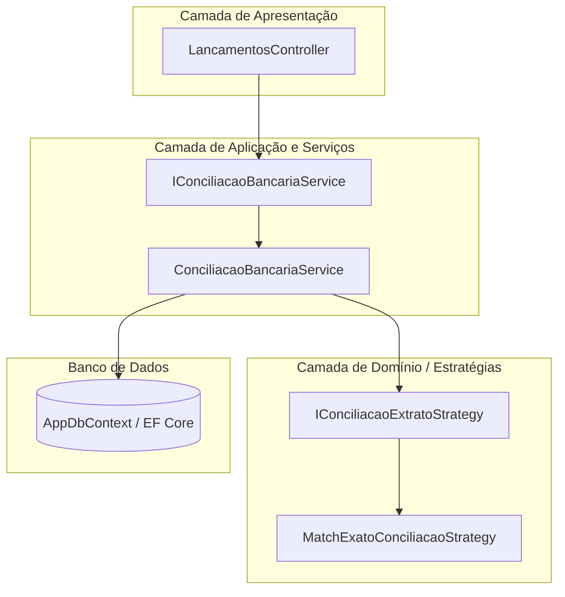
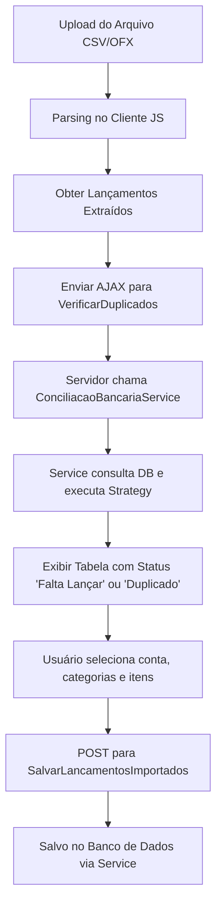

# Especificação Técnica e Arquitetura: Módulo de Importação de Extratos e Conciliação Bancária

> **Nota:** Este documento foi elaborado para servir como um guia completo e instrução técnica para modelos de Inteligência Artificial ou desenvolvedores implementarem ou refatorarem os recursos de **Importação de Extratos (CSV / OFX)** e **Conciliação Bancária** (anteriormente denominado "Comparar Extrato").

---

## 1. Visão Geral do Módulo

O módulo de **Lançamentos Financeiros** possui duas funcionalidades centrais relacionadas à integração com extratos bancários:

1. **Importação de Extrato (`ImportarExtrato`)**: Permite a ingestão de arquivos bancários nos formatos **CSV** e **OFX**, parsing no cliente, verificação de duplicados em relação ao banco de dados e gravação em lote dos novos lançamentos.
2. **Conciliação Bancária (`CompararExtrato`)**: Compara os registros presentes no arquivo de extrato bancário com os lançamentos existentes no banco de dados para a conta e período selecionados, identificando:
   - Registros **Conciliados** (presentes em ambos com mesma Data, Valor e Tipo).
   - Registros **Apenas no Extrato** (faltantes no sistema, com opção de salvar em lote).
   - Registros **Apenas no Sistema** (cadastrados no sistema no período, mas ausentes no extrato).

---

## 2. Arquitetura do Módulo (DDD + Strategy Pattern)

Em conformidade com os princípios do **Domain-Driven Design (DDD)** e o **Strategy Pattern**, a regra de negócio da conciliação bancária é desacoplada dos controladores web:



### 2.1 Componentes Arquiteturais

1. **Camada de Serviços (`GestorContas.Web.Services.Conciliacao`)**:
   - `IConciliacaoBancariaService`: Interface do serviço de aplicação que expõe os casos de uso do módulo (`VerificarDuplicadosAsync`, `ProcessarComparacaoExtratoAsync`, `SalvarLancamentosImportadosAsync`).
   - `ConciliacaoBancariaService`: Implementação concreta do serviço, responsável pela orquestração do banco de dados (EF Core) e chamada da estratégia de conciliação.

2. **Estratégias de Conciliação (`Strategy Pattern`)**:
   - `IConciliacaoExtratoStrategy`: Define o contrato para os algoritmos de pareamento entre dados do extrato e registros do banco.
   - `MatchExatoConciliacaoStrategy`: Implementação da estratégia exata 1-para-1 por `Data.Date`, `Valor` e `Tipo`, com controle de duplicidade e pareamento utilizando `HashSet<int>`.

3. **Injeção de Dependências (`Program.cs`)**:
   ```csharp
   builder.Services.AddScoped<IConciliacaoExtratoStrategy, MatchExatoConciliacaoStrategy>();
   builder.Services.AddScoped<IConciliacaoBancariaService, ConciliacaoBancariaService>();
   ```

---

## 3. Modelos de Dados e Enumerações

### 3.1 Enum `TipoLancamento`
```csharp
namespace GestorContas.Web.Models.Enums
{
    public enum TipoLancamento
    {
        Entrada = 1,
        Saida = 2
    }
}
```

### 3.2 Entidade `Lancamento`
```csharp
namespace GestorContas.Web.Models
{
    public class Lancamento
    {
        [Key]
        public int Id { get; set; }

        [Required(ErrorMessage = "O campo {0} é obrigatório")]
        [StringLength(200, ErrorMessage = "O campo {0} deve ter no máximo {1} caracteres")]
        [Display(Name = "Descrição")]
        public string Descricao { get; set; }

        [StringLength(200, ErrorMessage = "O campo {0} deve ter no máximo {1} caracteres")]
        [Display(Name = "Descrição no Extrato")]
        public string? DescricaoNoExtrato { get; set; }

        [Required(ErrorMessage = "O campo {0} é obrigatório")]
        [DataType(DataType.Currency)]
        [Column(TypeName = "decimal(18,2)")]
        [Display(Name = "Valor")]
        public decimal Valor { get; set; }

        [Required(ErrorMessage = "O campo {0} é obrigatório")]
        [Display(Name = "Tipo")]
        public TipoLancamento Tipo { get; set; }

        [Required(ErrorMessage = "O campo {0} é obrigatório")]
        [DataType(DataType.Date)]
        [DisplayFormat(DataFormatString = "{0:dd/MM/yyyy}", ApplyFormatInEditMode = true)]
        [Display(Name = "Data")]
        public DateTime Data { get; set; } = DateTime.Now.Date;

        [Required(ErrorMessage = "O campo {0} é obrigatório")]
        [Display(Name = "Categoria")]
        public int CategoriaId { get; set; }

        public Categoria? Categoria { get; set; }

        [Required(ErrorMessage = "O campo {0} é obrigatório")]
        [Display(Name = "Conta")]
        public int ContaId { get; set; }

        public Conta? Conta { get; set; }
    }
}
```

### 3.3 DTOs do Serviço de Conciliação (`GestorContas.Web.Services.Conciliacao.Dtos`)
```csharp
public class ItemExtratoDto
{
    public DateTime Data { get; set; }
    public decimal Valor { get; set; }
    public TipoLancamento Tipo { get; set; }
    public string Descricao { get; set; } = string.Empty;
}

public class ItemConciliadoDto
{
    public ItemExtratoDto Extrato { get; set; } = new();
    public ItemSistemaDto Sistema { get; set; } = new();
}

public class ItemSistemaDto
{
    public int Id { get; set; }
    public DateTime Data { get; set; }
    public string Descricao { get; set; } = string.Empty;
    public decimal Valor { get; set; }
    public TipoLancamento Tipo { get; set; }
    public string CategoriaNome { get; set; } = string.Empty;
}

public class ResultadoConciliacaoDto
{
    public List<ItemConciliadoDto> Conciliados { get; set; } = new();
    public List<ItemExtratoDto> ApenasExtrato { get; set; } = new();
    public List<ItemSistemaDto> ApenasSistema { get; set; } = new();
    public int TotalExtrato => Conciliados.Count + ApenasExtrato.Count;
    public int TotalSistemaNoPeriodo => Conciliados.Count + ApenasSistema.Count;
}

public class ResultadoVerificacaoDuplicadoDto
{
    public string Status { get; set; } = "novo"; // "duplicado" ou "novo"
    public int? DbId { get; set; }
    public string? DescricaoDb { get; set; }
}
```

---

## 4. Especificação de Ingestão e Parsing de Arquivos

### 4.1 Auto-detecção e Tratamento de Encodings
Para evitar distorções de caracteres (mojibake) como `Transferência`, a leitura de arquivos utiliza inspeção por bytes (`readAsArrayBuffer` + `TextDecoder`):
1. **Detecção por BOM UTF-8**: Se os 3 primeiros bytes forem `EF BB BF`, força decodificação em `utf-8`.
2. **Inspeção de Sequências de Byte UTF-8 / Mojibake**: Examina a presença do byte inicial `0xC3` seguido por bytes de continuação `0x80-0xBF` comuns em textos com acentuação codificados em UTF-8.
3. **Detecção UTF-16**: Presença de bytes nulos (`\0`) ativa decodificação via `utf-16`.
4. **Fallback inteligente**: Se o leitor iniciar em ISO-8859-1 e produzir padrões de mojibake (contendo `Ã` ou `Â`), o leitor efetua fallback automático para `utf-8`.

---

### 4.2 Parsing de Arquivo OFX (Open Financial Exchange)

1. **Quebra em Blocos**:
   - Dividir o conteúdo utilizando a expressão regular `/<STMTTRN\s*>/i`.
   - Iterar sobre os blocos até o fechamento `</STMTTRN>`.
2. **Extração de Tags**:
   - `TRNTYPE`: Tipo da transação no OFX (ex: `DEBIT`, `CREDIT`, `OTHER`).
   - `DTPOSTED`: Data do lançamento no formato `YYYYMMDD...` (obter os 8 primeiros caracteres para extrair `YYYY`, `MM` e `DD`).
   - `TRNAMT`: Valor numérico (positivo ou negativo). Substituir vírgulas por ponto e parsear para float/decimal.
   - `MEMO` / `NAME`: Descrição/histórico da transação. Fallback para "Sem descrição" se vazio.
3. **Definição de Tipo e Valor**:
   - **Tipo 2 (Saída)**: Se `Valor < 0` ou `TRNTYPE == 'DEBIT'`.
   - **Tipo 1 (Entrada)**: Demais casos.
   - **Valor**: Armazenar sempre como valor absoluto positivo (`Math.abs(valor)`).

---

### 4.3 Parsing de Arquivo CSV

1. **Detecção e Seleção de Delimitador**:
   - **Auto-detecção**: Varrer as primeiras 10 linhas contando a ocorrência de `;` (ponto e vírgula) vs `,` (vírgula). Se o total de vírgulas for maior, assumir separador `,`, caso contrário `;`.
   - **Seleção Manual**: Permitir override pelo usuário por meio de radio buttons (`csvSeparator` / `compCsvSeparator`).
2. **Estrutura por Delimitador**:
   - **Separador Ponto e Vírgula (`;`)**:
     - Coluna 0: Data (formato `DD/MM/YYYY`).
     - Coluna 3: Histórico / Descrição.
     - Coluna 4: Valor (positivo para entradas, negativo para saídas).
   - **Separador Vírgula (`,`)**:
     - Coluna 0: Data (formato `DD/MM/YYYY`).
     - Coluna 2: Descrição.
     - Coluna 4: Crédito (Entrada).
     - Coluna 5: Débito (Saída).
3. **Regras de Negócio e Limpeza**:
   - Ignorar linhas vazias e o cabeçalho.
   - Ignorar transações cujo histórico contenha `"SALDO ANTERIOR"`.
   - Validar expressão regular de data: `/^\d{2}\/\d{2}\/\d{4}$/`.
   - Remover aspas e espaços do valor antes da conversão decimal.

---

## 5. Funcionalidade 1: Importar Extrato (`/Lancamentos/ImportarExtrato`)

### 5.1 Fluxo de Trabalho (Workflow)


### 5.2 Verificação de Duplicados e Atribuição de Categoria/Tipo por Aproximação (`VerificarDuplicados`)
- **Regra do Serviço**:
  O `LancamentosController` recebe a requisição, mapeia os DTOs e chama `_conciliacaoService.VerificarDuplicadosAsync(request.ContaId, itens)`.
- **Regra de Localização por Aproximação (Ordem de Prioridade)**:
  Quando um lançamento do extrato não for um duplicado exato, a estratégia `MatchExatoConciliacaoStrategy` faz uma busca por aproximação no histórico de lançamentos cadastrados na conta para sugerir a **Categoria** e adotar o mesmo **Tipo** (Entrada/Saída):
  1. **1ª Preferência**: Match por `Descricao` exata.
  2. **2ª Preferência**: Match por `DescricaoNoExtrato` exata.
  3. **3ª Preferência**: Match por sub-string/contém em `Descricao`.
  4. **4ª Preferência**: Match por sub-string/contém em `DescricaoNoExtrato`.
- Ao encontrar um lançamento relevante nessa ordem de preferência, a estratégia atribui automaticamente a `CategoriaIdSugerida` e atualiza o `Tipo` do lançamento importado para o mesmo tipo encontrado no histórico.

### 5.3 Salvamento em Lote (`SalvarLancamentosImportados`)
- O cliente envia os lançamentos via `JSON` para o endpoint `/Lancamentos/SalvarLancamentosImportados`, incluindo o valor de `DescricaoNoExtrato` (preservando o texto original vindo do extrato).
- O controller delega a execução para `_conciliacaoService.SalvarLancamentosImportadosAsync(lancamentos)`.
- O serviço garante `Id = 0` para cada objeto e executa `_context.Lancamentos.Add(lancamento)` seguido de `SaveChangesAsync()`.

---

## 6. Funcionalidade 2: Conciliação Bancária (`/Lancamentos/CompararExtrato`)

### 6.1 Conceito e Diferencial
A **Conciliação Bancária** foca no cruzamento completo das duas fontes de dados no período do extrato:
1. **Extrato Bancário** (arquivo importado).
2. **Sistema Financial** (lançamentos existentes no banco de dados para a conta e período).

### 6.2 Algoritmo de Processamento da Conciliação (`ProcessarComparacaoExtrato`)
- O controller recebe a requisição AJAX, converte em `List<ItemExtratoDto>` e chama `_conciliacaoService.ProcessarComparacaoExtratoAsync(request.ContaId, itens)`.
- O serviço obtém os registros cadastrados no DB no período e invoca a estratégia `MatchExatoConciliacaoStrategy.Conciliar`, separando os registros nos 3 grupos:
  - `Conciliados`: Pareamento exato por `Data.Date`, `Valor` e `Tipo`.
  - `ApenasExtrato`: Presentes apenas no extrato.
  - `ApenasSistema`: Registros cadastrados no sistema sem correspondente no extrato.

### 6.3 Interface de Usuário da Conciliação

1. **Cards Resumo (KPIs)**:
   - **No Extrato**: Quantidade total de lançamentos lidos do arquivo.
   - **Conciliados**: Total de registros que deram match exato.
   - **Apenas no Extrato**: Registros faltantes no sistema.
   - **Apenas no Sistema**: Registros no sistema sem correspondente no extrato.
2. **Visualização por Abas**:
   - **Aba 1: Apenas no Extrato (Faltantes)**:
     - Apresenta tabela editável dos lançamentos do extrato que não estão no sistema.
     - Permite atribuir a categoria desejada e salvá-los no sistema chamando `SalvarLancamentosImportados`.
     - Após salvar, a conciliação é reexecutada automaticamente para atualizar os cards e status.
   - **Aba 2: Conciliados**:
     - Apresenta a comparação lado a lado da descrição do extrato vs descrição do sistema, valor, tipo e categoria atribuída, acompanhado do badge `OK`.
   - **Aba 3: Apenas no Sistema**:
     - Apresenta os lançamentos cadastrados no sistema dentro do período de datas do extrato, porém sem correspondência no arquivo.

---

## 7. Endpoints da API (Controllers)

| Método HTTP | Rota | Descrição |
| :--- | :--- | :--- |
| `GET` | `/Lancamentos/ImportarExtrato` | Renderiza a tela ou partial modal de importação |
| `GET` | `/Lancamentos/CompararExtrato` | Renderiza a tela ou partial modal de conciliação bancária |
| `GET` | `/Lancamentos/GetDescricoes` | Retorna lista distinct de descrições históricas para autocomplete |
| `GET` | `/Lancamentos/ObterSugestaoDescricao` | Busca no histórico da conta o Tipo e Categoria mais prováveis para uma descrição alterada |
| `POST` | `/Lancamentos/VerificarDuplicados` | Delega ao `IConciliacaoBancariaService` a verificação de duplicidade |
| `POST` | `/Lancamentos/ProcessarComparacaoExtrato` | Delega ao `IConciliacaoBancariaService` a execução da estratégia de conciliação |
| `POST` | `/Lancamentos/SalvarLancamentosImportados` | Delega ao `IConciliacaoBancariaService` a gravação em lote no banco |

---

## 8. Requisitos de UX / UI para Modelos de IA Implementadores

1. **Suporte AJAX / Modal**:
   - As views devem detectar se a requisição é AJAX (`Context.Request.Headers["X-Requested-With"] == "XMLHttpRequest"`). Em caso afirmativo, definir `Layout = null` para exibição em modais sem duplicar o layout global.
2. **Segurança e Validação**:
   - Incluir token anti-forgery (`@Html.AntiForgeryToken()`) e enviar no header `RequestVerificationToken` em todas as chamadas `fetch` do tipo `POST`.
3. **Feedback do Usuário**:
   - Utilizar `SweetAlert2` para confirmações de ação (limpar lista, erro no parsing, sucesso na gravação).
   - Exibir spinners/progress-bar durante o processamento do arquivo e requisições AJAX.
